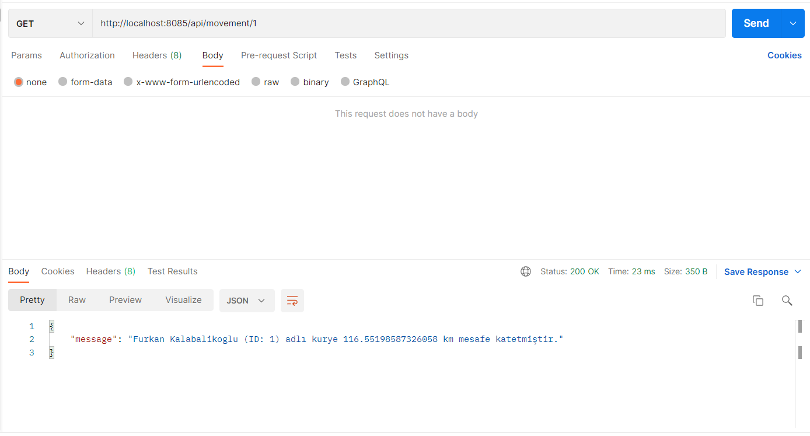

This program has written for Migros for test case. 
Requirements & solutions & descriptions:
1) Log courier and store when any courier enters radius of 100 meters from Migros
   stores. Reentries to the same store's circumference over 1 minute should not count
   as "entrance".
   1) Example postman screenshot for case
      1) Courier's movement is not an entrance
      2) Courier's movement is an entrance but he/she has already entered given store within last 1 minute
         
   2) Example postman screenshot for case
      1) Courier's movement is an entrance
         
   3) Example postman screenshot for error case
         
2) The application must provide a way for querying total distances, over which any
   courier travels. 
   1) Example postman screenshot for case
      1) Courier's travelled total distance returned successfully
         
   2) Example postman screenshot for exception case
         

Notes:
   1) Javadocs added for codeblocks.
   2) MSSQL has used as data source and JDBC has used for database connectivity.
   3) Flyway has used for versioning.
   4) Each response messages has localized.
   5) Guava cache has used for some specific cases.
   6) Some explanation has been added on test_description file for test cases.